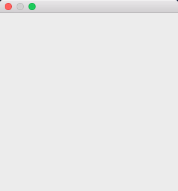

# ApplicationWithMessageLoop

This example demonstrates the use of NSApplication and NSEvent clesses.

# Source

[ApplicationWithMessageLoop.cpp](./ApplicationWithMessageLoop.cpp)

[CMakeLists.txt](./CMakeLists.txt)

# Output

