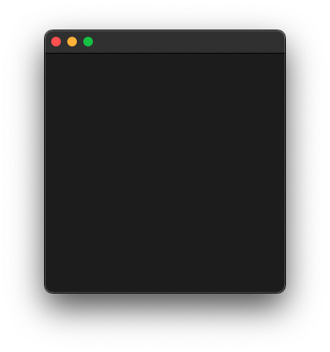

# ApplicationWithMessageLoop

This example demonstrates the use of NSApplication and NSEvent clesses.

## Sources

[ApplicationWithMessageLoop.m](./ApplicationWithMessageLoop.m)

[CMakeLists.txt](./CMakeLists.txt)

## Generate and build

To build this project, open "Terminal", go to your project folder and type following lines:

``` cmake
mkdir build
cd build
cmake .. -G "Xcode"
open ./ApplicationWithMessageLoop.xcodeproj
```

Select `ApplicationWithMessageLoop` project and type Cmd+R to build and run it.

## Output



