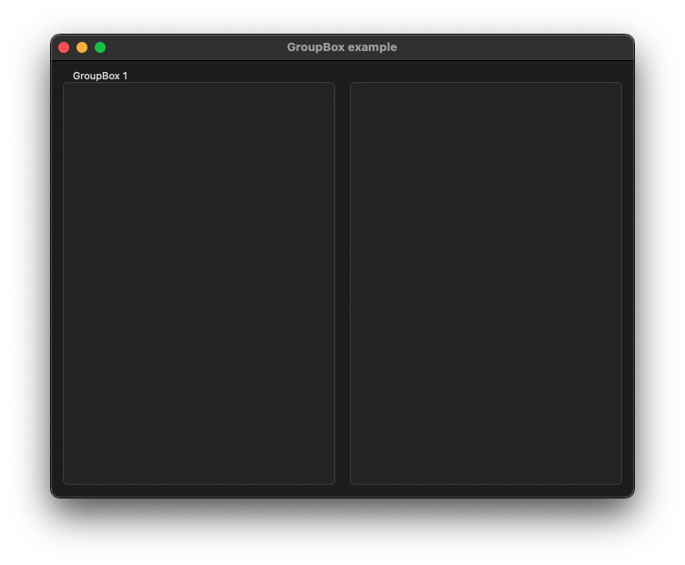

# GroupBox

This example demonstrates the use of NSBox control.

## Sources

[GroupBox.m](GroupBox.m)

[CMakeLists.txt](CMakeLists.txt)

## Generate and build

To build this project, open "Terminal", go to your project folder and type following lines:

``` cmake
mkdir build
cd build
cmake .. -G "Xcode"
open ./GroupBox.xcodeproj
```

Select `GroupBox` project and type Cmd+R to build and run it.

## Output



