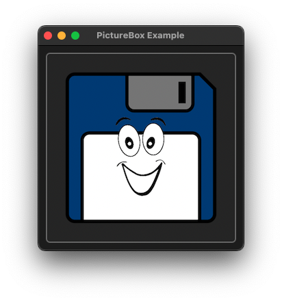

# PictureBox

This example demonstrates the use of NSImageView control.

## Sources

[PictureBox.m](PictureBox.m)

[CMakeLists.txt](CMakeLists.txt)

[Resources/logo.png](Resources/Logo.png)

## Generate and build

To build this project, open "Terminal", go to your project folder and type following lines:

``` cmake
mkdir build
cd build
cmake .. -G "Xcode"
open ./PictureBox.xcodeproj
```

Select `PictureBox` project and type Cmd+R to build and run it.

## Output



