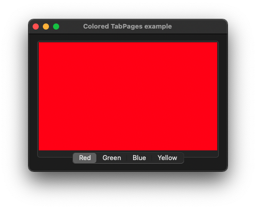

# ColoredTabPages

This example demonstrates the use of NSTabView, colored NSTabViewItem controls and NSColor class.

# Source

[ColoredTabPages.m](./ColoredTabPages.m)

[CMakeLists.txt](./CMakeLists.txt)

# Output

